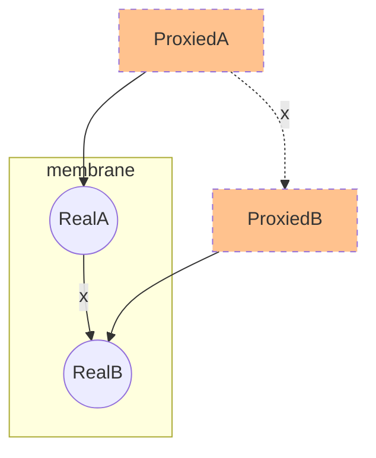
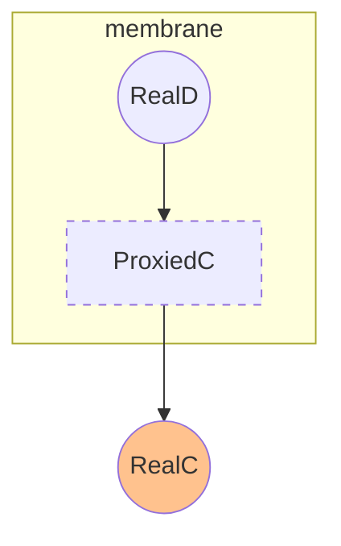

Expand upon the solution of storing the revoke functions in WeakRefs by also storing refs to previously created proxies, thus only proxying each object once. By creating two maps we can keep track of the proxied objects and the original objects and ensure that object equality is maintained across the boundary

```typescript
function getSomeProtectedObject() {
  const RealA = { x: RealB };
  return createMembrane(RealA);
}
const ProxiedA = getSomeProtectedObject();
const ProxiedB = ProxiedA.x
```


```typescript
function getSomeProtectedObject() {
  const RealD = {};
  RealD.fn = function(externalThing){
    this.x = externalThing
  }
  return createMembrane(RealD);
}
const ProxiedD = getSomeProtectedObject();
const RealC = {foo: "bar"};
ProxiedD.fn(RealC)
```
